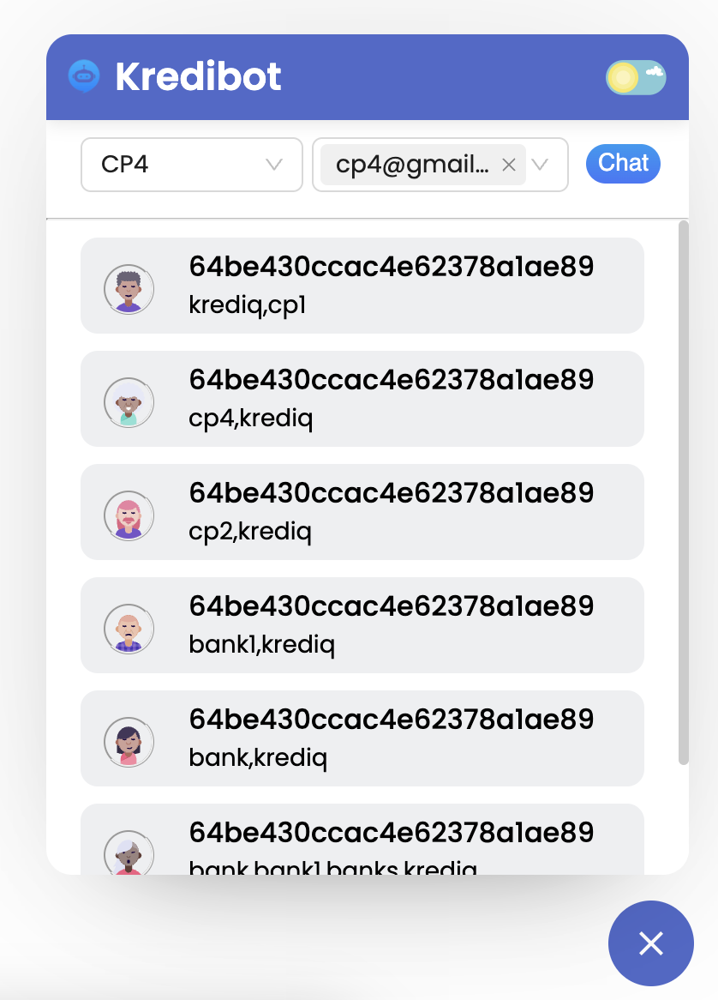
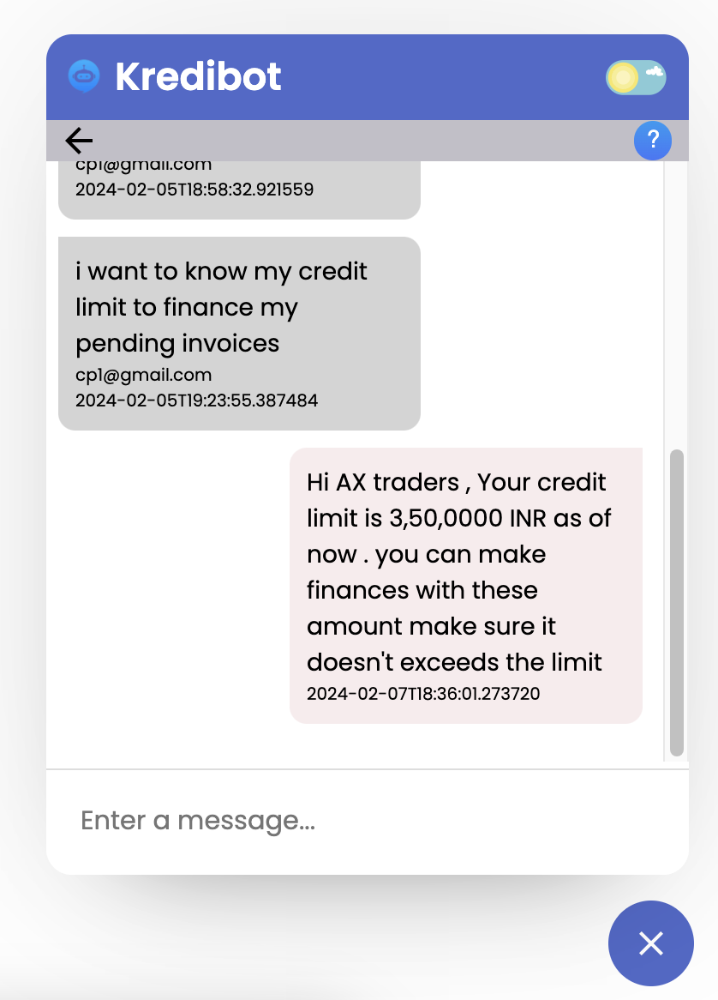

# Kredibot

A node SDK tailored for react applications enabling chatbot interface with banks and customers within the krediq ecosystem and enabling a end to end communication within parties . 

   


## Features

- Real-time messaging: Users can send and receive messages instantly.
- Easy integrations for multiple clients .
- Automatic chat suggesstions .

## Technologies Used

- React
- AntDesign


## Installation

To install and run the project locally, follow these steps:

1. Clone the repo 
2. Navigate to the project directory: `cd kredibot`

```
- npm install
- npm run dev
```